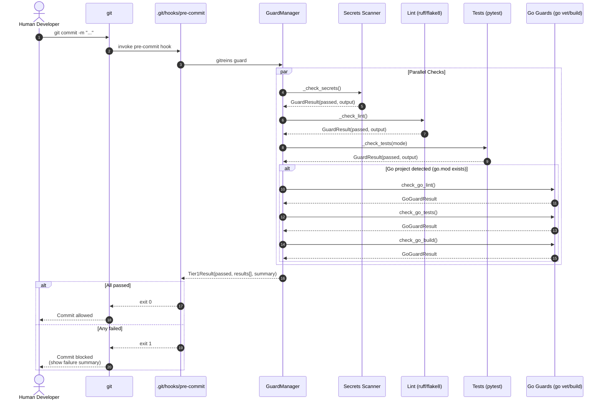
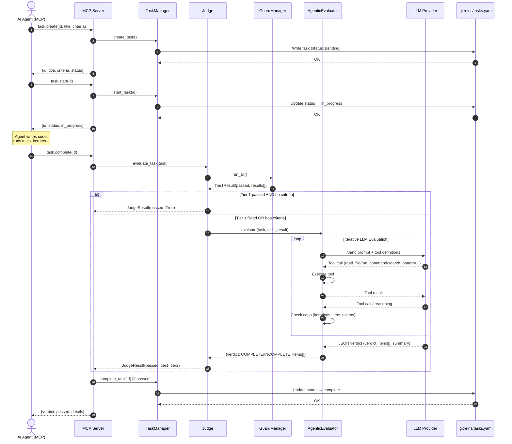
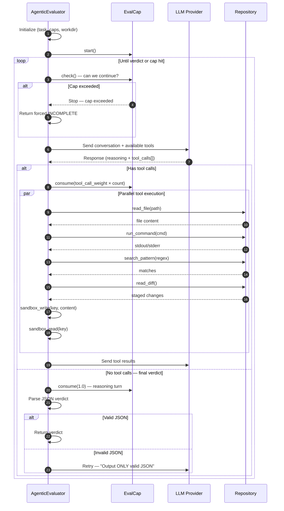

# 01-Architecture.md — System Architecture

> **Document Status:** Draft | **Last Updated:** 2026-07-19 | **Author:** GitReins Architecture Spec

---

## 1. Container Architecture

GitReins is a git-native agent co-harness that sits between the developer (human or AI) and the git repository. It enforces quality gates at pre-commit time (Tier 1 static checks) and evaluates task completeness post-coding (Tier 2 agentic evaluation). The system is composed of three runtime surfaces — a human CLI, an MCP server for AI agents, and a shared evaluation engine.

```mermaid
C4Container
    title GitReins Container Architecture

    Person(human, "Human Developer", "Runs gitreins CLI commands")
    Person(agent, "AI Agent", "Pi, Claude, Hermes, Codex via MCP")

    System_Boundary(gitrepo, "Git Repository") {
        ContainerDb(tasks_yaml, "tasks.yaml", "YAML", "Task definitions + criteria")
        ContainerDb(config_yaml, "config.yaml", "YAML", "Guards, pipeline, caps, defaults")
        ContainerDb(history, "history/", "Git/FS", "Verdict persistence")
    }

    System_Boundary(gitreins, "GitReins") {
        Container(cli, "CLI", "Python", "Human interface: task CRUD, guard run, judge, commit")
        Container(mcp, "MCP Server", "Python", "JSON-RPC 2.0 stdio: task.*, judge.evaluate, commit, guard.run, propagate")

        
        Container(engine, "Engine", "Python", "Shared evaluation core") {
            Component(gm, "GuardManager", "Static checks: secrets, lint, tests, dead code, LSP, static analysis, Go guards")
            Component(dead, "DeadCodeDetector", "Python AST unused-code and unreachable-code findings")
            Component(lsp, "LSP Guard", "Language-server diagnostics over stdio")
            Component(static, "Static Analysis", "Normalized language-specific analyzer diagnostics")
            Component(eval, "AgenticEvaluator", "Iterative LLM loop with tool calls")
            Component(judge, "Judge", "Orchestrates Tier 1 + Tier 2 / pipeline")
            Component(pipe, "Pipeline", "Config-driven stage execution")
            Component(audit, "CommitAuditor", "Tier 2 message validation and CodeRabbit-style review")
            Component(propagate, "Propagator", "Cross-repo guard-config recursive merge")
            Component(cap, "EvalCap", "Iteration/time/token/tool caps")
            Component(cfg, "Config", "Unified defaults + overlay")
            Component(llm, "LLMClient", "Multi-provider with retry")
        }
    }

    System_Ext(llm_provider, "LLM Provider", "OpenAI, Anthropic, OpenRouter, local")

    Rel(human, cli, "Uses", "bash")
    Rel(agent, mcp, "Connects via stdio", "JSON-RPC 2.0")
    Rel(cli, engine, "Invokes", "Python import")
    Rel(mcp, engine, "Invokes", "Python import")
    Rel(mcp, propagate, "Invokes", "Python import")
    Rel(engine, tasks_yaml, "Reads/Writes", "YAML")
    Rel(engine, config_yaml, "Reads", "YAML")
    Rel(engine, history, "Writes verdicts", "Git or filesystem")
    Rel(llm, llm_provider, "API calls", "HTTP/HTTPS")
```

**Runtime surfaces:**
- **CLI** (`gitreins/cli.py`) — Human-facing commands: `install`, `task create/start/complete/list/delete`, `guard`, `judge <id>`, `commit <msg>`, `commit-audit`, `setup-tools`, and `mcp-server`
- **MCP Server** (`gitreins_mcp/server.py`) — AI agent interface via JSON-RPC 2.0 over stdio. Exposes 10 tools: `task.create`, `task.start`, `task.complete`, `task.list`, `task.get`, `task.delete`, `commit`, `guard.run`, `judge.evaluate`, and `propagate`
- **Engine** — Shared Python modules imported by both CLI and MCP server. No network service; all execution is in-process.

**Data stores:**
- `.gitreins/tasks.yaml` — Task definitions with criteria and status
- `.gitreins/config.yaml` — Repository-specific configuration overlay
- `.gitreins/history/` — Verdict persistence (git branch or filesystem)

---

## 2. Data Flow — Guard Run

The pre-commit hook (`gitreins guard`) runs Tier 1 static checks on staged changes before allowing a commit to proceed. This is the fast path — no LLM involved.



**Guard types (configurable via `.gitreins/config.yaml`):**

| Guard | Tool | Config Key | Default |
|-------|------|------------|---------|
| Secrets | gitleaks or built-in patterns | `guards.secrets` | `true` |
| Lint | ruff / flake8 | `guards.lint` | `true` |
| Tests | pytest (full or diff-mode) | `guards.tests` | `true` |
| Dead Code | Python AST detector | `guards.dead_code` | `false` |
| LSP | Configured language server over stdio | `guards.lsp` / `guards.lsp_tools` | `false` |
| Static Analysis | Configured language-specific analyzer | `guards.static_analysis` / `guards.static_analysis_tools` | `false` |
| Go Lint | golangci-lint / go vet | auto-detected | — |
| Go Tests | `go test` | auto-detected | — |
| Go Build | `go build` | auto-detected | — |

**Test modes:**
- `full` — Run entire test suite (`pytest -x --tb=short`)
- `diff` — Run only tests related to changed files (smart detection)

**Go project detection:** If `go.mod` exists in the repo root, Go-specific guards (`go_lint`, `go_tests`, `go_build`) are automatically added to the guard run.

---

## 3. Data Flow — Task Lifecycle

A task moves from `pending` → `in_progress` → `complete` through a two-tier evaluation pipeline. The AI agent drives the coding phase; GitReins evaluates the result.



**Evaluation outcomes:**

| Verdict | Meaning | Action |
|---------|---------|--------|
| `COMPLETE` | All criteria PASS | Task marked `complete`, commit allowed |
| `INCOMPLETE` | One or more criteria FAIL | Task stays `in_progress`, agent must fix |

**Per-criterion result:** Each item in the verdict contains:
- `criterion` — The exact criterion text from the task
- `status` — `PASS` or `FAIL`
- `detail` — File path, line number, or test output as evidence

---

## 4. Component Map

| Module | File | Lines | Responsibility | Key Classes/Functions |
|--------|------|-------|----------------|---------------------|
| **GuardManager** | `engine/guard_manager.py` | 818 | Tier 1 checks: secrets, lint, tests, dead code, LSP, static analysis, Go guards | `GuardResult`, `Tier1Result`, `GuardManager.run_all()` |
| **AgenticEvaluator** | `engine/evaluator.py` | 739 | Iterative LLM evaluation loop with 7 tools | `AgenticEvaluator`, `EVALUATOR_TOOLS`, `EVALUATOR_SYSTEM_PROMPT` |
| **EvalCap** | `engine/eval_cap.py` | 442 | Flexible caps: iterations, time, tokens, tool weight | `EvalCap`, `parse_eval_cap()`, `eval_cap_from_config()` |
| **LLMClient** | `engine/llm.py` | 353 | Multi-provider LLM client with retry | `LLMClient`, `LLMResponse`, `ToolCall`, `LLMUsage` |
| **Judge** | `engine/judge.py` | 141 | Orchestrates Tier 1 + Tier 2 / pipeline | `Judge`, `JudgeResult`, `evaluate_task()` |
| **Pipeline** | `engine/pipeline.py` | 478 | Config-driven multi-stage evaluation | `Pipeline`, `StageResult`, `StepResult`, `load_pipeline_config()` |
| **Config** | `engine/config.py` | 318 | Unified defaults with overlay system | `GitReinsDefaults`, `overlay()`, `load_defaults()` |
| **TaskManager** | `engine/task_manager.py` | 174 | CRUD for `.gitreins/tasks.yaml` | `Task`, `TaskManager`, `DependencyError` |
| **MCP Server** | `gitreins_mcp/server.py` | 517 | JSON-RPC 2.0 stdio MCP server | `GitReinsMCPServer`, `_tool_schemas()` |
| **CLI** | `gitreins/cli.py` | 546 | Human-facing command line | `main()`, `load_config()`, `PRE_COMMIT_HOOK` |
| **Guards (Go)** | `engine/guards.py` | 112 | Go-specific guard checks | `is_go_project()`, `check_go_lint()`, `check_go_tests()`, `check_go_build()` |
| **Dead Code** | `engine/dead_code.py` | 289 | AST-based dead code detection | `DeadCodeDetector`, `DeadCodeFinding`, `DeadCodeReport` |
| **LSP Guard** | `engine/lsp.py` | 461 | Starts configured language servers over stdio and normalizes diagnostics | `LspDiag`, `run_lsp_check()` |
| **Static Analysis** | `engine/static_analysis.py` | 578 | Runs configured analyzers and normalizes their diagnostics | `StaticDiag`, `run_static_check()` |
| **Commit Audit** | `engine/commit_audit.py` | 1,005 | Tier 2 message validation and CodeRabbit-style code review with CVE-style scores | `CommitAuditor`, `CommitReviewResult` |
| **Propagate** | `engine/propagate.py` | 180 | Copies guard config across sibling repos while preserving target overrides | `Propagator`, `Propagator.propagate()` |
| **Persist** | `engine/persist.py` | 483 | Verdict persistence (git/FS) | `VerdictPersister`, `load_history_config()` |
| **Version** | `engine/version.py` | 1 | Package version | `__version__` |

**Total engine core:** ~5,262 lines (excluding tests, demos, docs, venv)

---

## 5. Config Load Order

GitReins uses a three-layer configuration system. Later layers override earlier ones.

```mermaid
flowchart TD
    A["Layer 1: Hardcoded Defaults<br/>engine/config.py<br/>GitReinsDefaults dataclass"] --> B["Layer 2: Repo Config<br/>./.gitreins/config.yaml<br/>YAML overlay"]
    B --> C["Layer 3: Explicit Params<br/>Constructor arguments<br/>CLI flags / MCP params"]
    
    A -->|overlay()| B
    B -->|Constructor| C
    
    style A fill:#e1f5fe
    style B fill:#e8f5e9
    style C fill:#fff3e0
```

**Layer 1 — Hardcoded defaults** (`engine/config.py`):
```python
model: "deepseek-v4-flash"
max_iterations: 100.0
max_seconds: -1.0  # unlimited
max_input_tokens: 10_000_000
max_output_tokens: 1_000_000
tool_call_weight: 0.1
check_for_updates: true
update_check_ttl_hours: 24.0
history_enabled: true
history_storage: "git"
history_max_verdicts: 1000
```

**Layer 2 — Repo config** (`.gitreins/config.yaml`):
- `defaults:` — Override any default field
- `guards:` — Enable/disable guards, set test mode/command
- `evaluator:` — Cap settings (iterations, time, tokens)
- `pipeline:` — Custom evaluation stages
- `history:` — Persistence mode and limits

**Layer 3 — Explicit params** — Passed to constructors at runtime:
- `Judge(llm=..., workdir=..., guard_config=..., eval_cap=...)`
- `judge.evaluate_task(task, max_iterations=50, max_time="10m")`

---

## 6. Evaluator Loop Internals

The AgenticEvaluator runs an iterative conversation with the LLM. The LLM reasons, calls tools, receives results, and reasons again — until it delivers a verdict or hits a cap.



**Available tools (7 total):**

| Tool | Purpose | Cost |
|------|---------|------|
| `read_file(path, offset, limit)` | Read source files | 0.1 iterations |
| `run_command(cmd)` | Run tests, lint, build | 0.1 iterations |
| `search_pattern(regex)` | Grep codebase | 0.1 iterations |
| `read_diff()` | Show staged changes | 0.1 iterations |
| `get_task_item(id)` | Read task criteria | 0.1 iterations |
| `sandbox_write(key, content)` | Scratch space | 0.1 iterations |
| `sandbox_read(key)` | Read scratch space | 0.1 iterations |

**Cap tracking:**
- Each LLM reasoning turn costs `1.0` iteration
- Each tool call costs `tool_call_weight` (default `0.1`)
- At `99.9/100`, a full reasoning turn (`1.0`) is still allowed — caps are checked BEFORE the call
- Time cap, input token cap, and output token cap are checked independently

**Verdict format (strict JSON):**
```json
{
  "verdict": "COMPLETE",
  "items": [
    {"criterion": "...", "status": "PASS", "detail": "file.go:42 — implements X"},
    {"criterion": "...", "status": "FAIL", "detail": "Missing Y in file.go"}
  ],
  "summary": "One sentence summary"
}
```

---

## 7. Monorepo Layout

```
gitreins-poc/
├── engine/                     # Core evaluation engine
│   ├── __init__.py
│   ├── guard_manager.py        # 818 lines — Tier 1 static checks
│   ├── evaluator.py            # 739 lines — Agentic LLM loop
│   ├── eval_cap.py             # 442 lines — Flexible caps
│   ├── llm.py                  # 353 lines — Multi-provider client
│   ├── judge.py                # 141 lines — Tier 1 + Tier 2 orchestrator
│   ├── pipeline.py             # 478 lines — Config-driven stages
│   ├── config.py               # 318 lines — Unified defaults
│   ├── task_manager.py         # 174 lines — Task CRUD
│   ├── guards.py               # 112 lines — Go-specific checks
│   ├── dead_code.py            # 289 lines — AST dead code detection
│   ├── lsp.py                  # 461 lines — LSP diagnostics guard
│   ├── static_analysis.py      # 578 lines — Analyzer diagnostics guard
│   ├── commit_audit.py         # 1,005 lines — Tier 2 commit review
│   ├── propagate.py            # 180 lines — Cross-repo config merge
│   ├── persist.py              # 483 lines — Verdict persistence
│   └── version.py              # 1 line — Package version
│
├── gitreins_mcp/               # MCP server for AI agents
│   ├── __init__.py
│   └── server.py               # 517 lines — JSON-RPC 2.0 stdio
│
├── gitreins/                   # Human CLI
│   └── cli.py                  # 546 lines — Command line interface
│
├── tests/                      # Test suite
│   ├── test_guard_manager.py
│   ├── test_evaluator.py
│   ├── test_eval_cap.py
│   ├── test_llm.py
│   ├── test_judge.py
│   ├── test_pipeline.py
│   ├── test_task_manager.py
│   ├── test_mcp_server.py
│   ├── test_mcp_integration.py
│   ├── test_cli.py
│   └── reliability/            # Reliability test fixtures
│       ├── dead-tests/
│       ├── hallucinated-import/
│       ├── missing-error-handling/
│       ├── secret-leak/
│       ├── silent-exception/
│       ├── silent-logic-bug/
│       └── wrong-control-flow/
│
├── specs/                      # Architecture & design specs
│   └── 01-Architecture.md        # This document
│
├── docs/                       # Additional documentation
│   ├── architecture.md
│   ├── build-vs-borrow.md
│   ├── component-map.md
│   ├── evaluator-loop.md
│   ├── implementation-plan.md
│   ├── pi-research.md
│   ├── sandbox.md
│   └── technology-choices.md
│
├── .github/workflows/           # CI/CD
│   └── ci.yml
│
├── .gitreins/                  # Per-repo GitReins config (created by install)
│   ├── config.yaml
│   └── tasks.yaml
│
├── demo-calc/                  # Demo: calculator project
├── demo-slugify/               # Demo: slugify project
├── apps/server/                # TypeScript server (experimental)
├── bin/                        # Shell wrappers
├── assets/                     # Banner images
├── website/                    # Landing page
├── dist/                       # Build artifacts
├── .venv/                      # Python virtual environment
├── pyproject.toml              # Package manifest
├── setup.py                    # Legacy setup
├── setup.cfg                   # Package config
├── MANIFEST.in
├── .gitignore
├── .env
├── AGENTS.md
├── CONTRIBUTING.md
└── category-mapping.yaml
```

**Key directories:**
- `engine/` — The shared core. Imported by both CLI and MCP server. No external dependencies beyond `requests`, `pyyaml`.
- `gitreins/` — Human CLI entry point. `gitreins` command installed via `pip install -e .`.
- `gitreins_mcp/` — AI agent entry point. Started via `gitreins mcp-server` or directly.
- `tests/` — Comprehensive test suite covering all engine modules and integration tests.
- `specs/` — Architecture and design specifications (this document and future specs).
- `.gitreins/` — Runtime configuration and task storage, created per repository by `gitreins install`.

---

## Appendix A: File Line Counts (Verified)

| File | Lines | Verified |
|------|-------|----------|
| `engine/guard_manager.py` | 551 | 2026-06-20 |
| `engine/evaluator.py` | 739 | 2026-06-20 |
| `engine/eval_cap.py` | 442 | 2026-06-20 |
| `engine/llm.py` | 353 | 2026-06-20 |
| `engine/judge.py` | 141 | 2026-06-20 |
| `engine/pipeline.py` | 478 | 2026-06-20 |
| `engine/config.py` | 318 | 2026-06-20 |
| `engine/task_manager.py` | 174 | 2026-06-20 |
| `engine/guards.py` | 112 | 2026-06-20 |
| `engine/dead_code.py` | 289 | 2026-07-19 |
| `engine/lsp.py` | 461 | 2026-07-19 |
| `engine/static_analysis.py` | 578 | 2026-07-19 |
| `engine/commit_audit.py` | 1,005 | 2026-07-19 |
| `engine/propagate.py` | 180 | 2026-07-19 |
| `engine/persist.py` | 483 | 2026-06-20 |
| `engine/version.py` | 1 | 2026-06-20 |
| `gitreins_mcp/server.py` | 517 | 2026-06-20 |
| `gitreins/cli.py` | 546 | 2026-06-20 |

---

*End of 01-Architecture.md*
