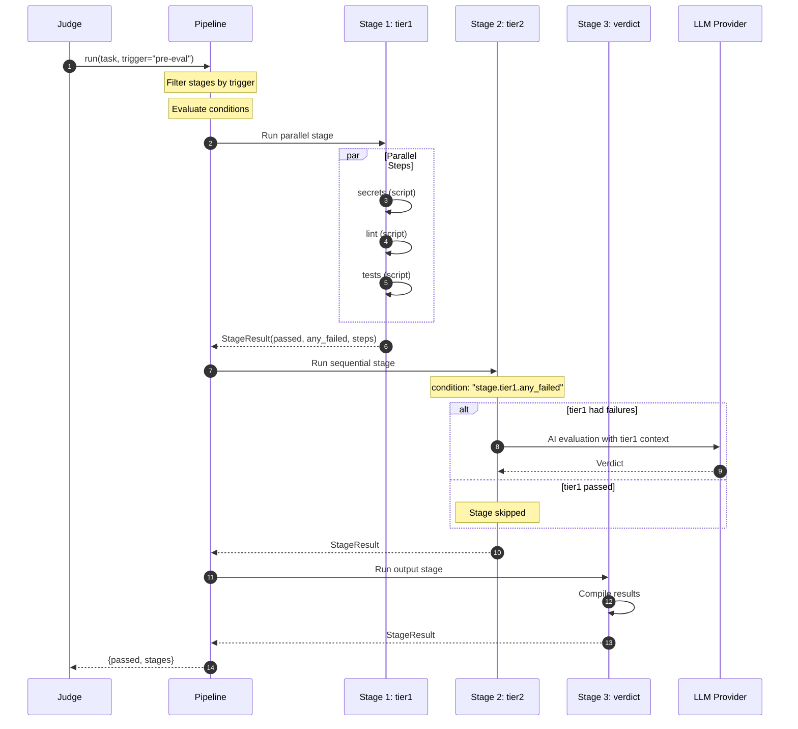

# 06-Pipeline.md — Pipeline Engine

> **Document Status:** Draft | **Last Updated:** 2026-06-20 | **Author:** GitReins Pipeline Spec

---

## 1. Mission

Document the config-driven pipeline engine that orchestrates GitReins' evaluation workflow. The pipeline loads stage definitions from `.gitreins/config.yaml` and executes them sequentially (with parallel step execution within stages). It supports conditional execution, result piping between stages, template variable substitution, and multiple step types including shell scripts, AI evaluation, and output display.

---

## 2. Scope

### In scope

- `Pipeline` class (`engine/pipeline.py`, ~479 lines) — stage loading, execution, result compilation
- Stage definition schema — `id`, `parallel`, `on`, `condition`, `steps`
- Step types — `script`, `ai_eval`, `output`
- Condition expressions — `true`, `stage.<id>.any_failed`, `stage.<id>.passed`, `task.has_criteria`, AND/OR support
- `on_fail` modes — `block`, `continue`
- Template variable substitution — `{{workdir}}`, `{{task_id}}`, `{{branch}}`, stage results
- YAML boolean pitfall — `on: [pre-commit]` parsed as `True: [pre-commit]` in PyYAML 1.1
- Default pipeline configuration (fallback when no config present)

### Out of scope

- Individual guard implementations (covered in `04-Guard-System.md`)
- Agentic evaluator internals (covered in `03-Evaluator-Design.md`)
- LLM client and cap system (covered in `03-Evaluator-Design.md`)
- Task manager CRUD (covered in `01-Architecture.md`)

---

## 3. Inputs & Outputs

### Inputs

| Input | Source | Description |
|-------|--------|-------------|
| `config` | Constructor | Dict from `.gitreins/config.yaml` |
| `workdir` | Constructor | Absolute path to repository root |
| `llm` | Constructor (optional) | LLMClient for `ai_eval` steps |
| `task` | `run()` | Task dict with `id`, `title`, `criteria`, `status` |
| `trigger` | `run()` | `"pre-commit"` or `"pre-eval"` — filters stage execution |

### Outputs

| Output | Type | Description |
|--------|------|-------------|
| `dict` | Result | `{passed: bool, stages: {stage_id: StageResult.to_dict()}}` |
| `StageResult` | dataclass | `{id, passed, any_failed, summary, steps: [StepResult]}` |
| `StepResult` | dataclass | `{id, type, passed, output, error, data}` |

---

## 4. Operating Contract

- **Stages run sequentially** — stage N completes before stage N+1 begins
- **Steps within a parallel stage run concurrently** — via `ThreadPoolExecutor(max_workers=len(steps))`
- **Trigger filtering happens before condition evaluation** — a stage must match the trigger AND satisfy its condition to run
- **Condition evaluation uses accumulated stage results** — conditions can reference any previously executed stage
- **Template substitution happens at execution time** — `{{ stage.tier1.passed }}` resolves to the actual result
- **Script step `on_fail: continue` marks the step as passed even if the command fails** — this feeds failure context to downstream AI evaluation without blocking the pipeline
- **AI eval steps are always sequential** — even inside a "parallel" stage, `ai_eval` steps run individually (they require the LLM client)

---

## 5. Assumptions & Dependencies

| # | Assumption | Risk if Violated |
|---|------------|------------------|
| 1 | `.gitreins/config.yaml` is valid YAML | Pipeline falls back to default configuration |
| 2 | `yaml.safe_load` is available | PyYAML is a required dependency |
| 3 | For `ai_eval` steps, LLM client is configured | Step fails with error if LLM unavailable |
| 4 | For `script` steps, shell commands are valid | Step fails with subprocess error |
| 5 | Stage IDs are unique within a pipeline | Duplicate IDs overwrite previous results in `_stage_results` |
| 6 | Condition expressions are well-formed | Malformed conditions evaluate to `True` (permissive default) |

---

## 6. Architecture

### 6.1 Pipeline Class

```python
class Pipeline:
    def __init__(self, config: dict, workdir: str = ".", llm=None)
    def run(self, task: dict, trigger: str = "pre-eval") -> dict
```

**Constructor behavior:**
1. Resolves `workdir` to absolute path
2. Extracts `pipeline.stages` list from config (defaults to empty list)
3. Stores optional `llm` reference for `ai_eval` steps
4. Initializes empty `_stage_results` dict

**`run()` execution flow:**

```mermaid
flowchart TD
    A[Pipeline.run] --> B[For each stage in pipeline.stages]
    B --> C{Trigger match?}
    C -->|no| B
    C -->|yes| D{Condition met?}
    D -->|no| B
    D -->|yes| E{parallel?}
    E -->|yes| F[_run_parallel_stage]
    E -->|no| G[_run_sequential_stage]
    F --> H[Store StageResult]
    G --> H
    H --> B
    B --> I[_compile_results]
    I --> J[Return {passed, stages}]
```

### 6.2 Pipeline Execution Flow



---

## 7. Core Design Decisions

### Decision 1: Sequential Stages with Parallel Steps

Stages run sequentially (stage N before stage N+1), but steps within a stage can run in parallel. This reflects the real dependency structure: Tier 1 guards (secrets, lint, tests) are independent and can run concurrently, but Tier 2 AI evaluation needs Tier 1 results as context.

**Rationale:** Parallel execution of independent checks reduces total guard run time. Sequential stages ensure proper result piping and context accumulation.

**Trade-off:** A failed step in a parallel stage does not block other steps. The stage's `any_failed` flag captures the overall state.

### Decision 2: Trigger-Based Stage Filtering

Stages declare when they run via the `on` field: `["pre-commit"]` for guard runs, `["pre-eval"]` for evaluation, or both. This allows the same pipeline definition to serve both the pre-commit hook and the task evaluation flow.

**Rationale:** Without triggers, the pre-commit hook would run AI evaluation (expensive and slow). With triggers, the pre-commit hook runs only fast script stages, while evaluation runs the full pipeline including AI.

**Trade-off:** Users must understand the trigger semantics. Misconfigured triggers can cause slow AI evaluation on every commit or skip evaluation entirely.

### Decision 3: Result Piping Between Stages

Stage results are stored in `_stage_results` and made available to downstream stages via template variables and condition expressions. This enables the evaluator to see Tier 1 failures and focus its investigation.

**Rationale:** The AI evaluator is most valuable when it knows what already failed. Piping Tier 1 results into the AI prompt reduces redundant work and focuses the LLM on actual problems.

**Trade-off:** Template substitution is string-based and can produce verbose output for large stage results. The `to_dict()` method caps output at 500 characters per step.

### Decision 4: Permissive Condition Evaluation

Malformed or unrecognized condition expressions evaluate to `True` (run the stage). This is the safe direction for a quality gate — better to run an extra check than skip a necessary one.

**Rationale:** Strict condition parsing would cause stages to be silently skipped due to typos or schema changes. Permissive evaluation ensures guards run even with config issues.

**Trade-off:** A misconfigured condition like `"stage.tier1.pass"` (missing `ed`) evaluates to `True` and runs the stage. This is usually harmless but may surprise users.

---

## 8. Detailed Design

### 8.1 Stage Definition Schema

```yaml
pipeline:
  stages:
    - id: tier1                    # Unique stage identifier
      parallel: true               # Steps run concurrently
      "on": [pre-commit, pre-eval]  # When this stage runs (quoted to avoid YAML bool pitfall)
      condition: "true"            # Optional: expression to evaluate
      steps:                       # List of steps (only for parallel stages)
        - id: secrets
          type: script
          run: "gitleaks detect --source . --no-git"
          on_fail: continue        # block | continue

    - id: tier2
      type: ai_eval                # Sequential stage (no steps list)
      "on": [pre-eval]
      condition: "stage.tier1.any_failed"
      max_iterations: 20
      tools: [read_file, run_command, search_pattern, read_diff, sandbox]
      prompt_template: |
        Evaluate task completeness.
        Tier 1 results: {{ stage.tier1 }}

    - id: verdict
      type: output
      "on": [pre-commit, pre-eval]
      format: "{{ stages }}"
```

**Stage fields:**

| Field | Type | Required | Description |
|-------|------|----------|-------------|
| `id` | string | Yes | Unique identifier for the stage |
| `parallel` | bool | No | If `true`, `steps` list runs concurrently. Default: `false` |
| `on` | list[string] | No | Triggers that activate this stage. Default: `["pre-eval", "pre-commit"]` |
| `condition` | string | No | Expression that must evaluate to `true` for the stage to run |
| `steps` | list[dict] | No | Steps to run (only for `parallel: true` stages) |
| `type` | string | No | For sequential stages: `"script"`, `"ai_eval"`, or `"output"` |
| `run` | string | No | Shell command (for `type: script`) |
| `on_fail` | string | No | `"block"` (default) or `"continue"` |
| `max_iterations` | int | No | Cap for AI evaluation steps |
| `tools` | list[string] | No | Tool whitelist for AI evaluation |
| `prompt_template` | string | No | Custom prompt for AI evaluation |
| `format` | string | No | Output format template (for `type: output`) |

### 8.2 Step Types

#### Type: `script`

Executes a shell command via `subprocess.run(cmd, shell=True, timeout=120)`.

| Field | Description |
|-------|-------------|
| `run` | Shell command to execute |
| `on_fail` | `"block"` — step fails, pipeline may stop. `"continue"` — step marked as passed, failure output preserved |

**Template substitution** happens before execution. Available variables: `{{workdir}}`, `{{task_id}}`, `{{task_title}}`, `{{task_criteria}}`, stage results.

**Return:** `StepResult` with `exit_code` in `data` dict.

#### Type: `ai_eval`

Runs the `AgenticEvaluator` against the task.

| Field | Description |
|-------|-------------|
| `model` | Override LLM model for this evaluation |
| `max_iterations` | Iteration cap (default: `-1` = unlimited) |
| `tools` | List of evaluator tools to expose (default: all 7) |
| `prompt_template` | Custom prompt injected into evaluation context |

**Behavior:**
1. Lazy-initializes LLM client if not already provided
2. Creates `AgenticEvaluator` with the task and caps
3. Calls `evaluator.evaluate(task)`
4. Parses verdict into `StepResult`

**Return:** `StepResult` with `verdict`, `items`, and `summary` in `data` dict.

#### Type: `output`

Compiles and displays results from previous stages.

| Field | Description |
|-------|-------------|
| `format` | Template string for output (default: `"{{ stages }}"`) |

**Return:** `StepResult` with compiled output string.

### 8.3 Condition Expressions

**Supported predicates:**

| Expression | Evaluates to `True` when |
|------------|--------------------------|
| `"true"` / `"always"` | Always |
| `"task.has_criteria"` | Task has at least one criterion |
| `"stage.<id>.any_failed"` | The referenced stage had at least one failed step |
| `"stage.<id>.passed"` | The referenced stage passed all steps |

**Boolean operators:**

| Operator | Syntax | Example |
|----------|--------|---------|
| OR | ` or ` | `"stage.tier1.any_failed or task.has_criteria"` |
| AND | ` and ` | `"stage.tier1.passed and task.has_criteria"` |

**Evaluation rules:**
- Empty or missing condition → `True`
- Malformed expression → `True` (permissive default)
- Referenced stage not yet executed → `False` (can't reference future stages)
- Case-sensitive stage ID matching

**Condition evaluation flow:**

```mermaid
flowchart TD
    A[_check_condition] --> B{condition empty?}
    B -->|yes| C[Return True]
    B -->|no| D{condition == "true"/"always"?}
    D -->|yes| C
    D -->|no| E{contains " or "?}
    E -->|yes| F[Split by " or ", return ANY true]
    E -->|no| G{contains " and "?}
    G -->|yes| H[Split by " and ", return ALL true]
    G -->|no| I{starts with "stage."?}
    I -->|yes| J[Lookup stage result, return property]
    I -->|no| K{== "task.has_criteria"?}
    K -->|yes| L[Return bool(task.criteria)]
    K -->|no| M[Return True]
```

### 8.4 on_fail Modes

| Mode | Behavior | Use Case |
|------|----------|----------|
| `"block"` (default) | Step fails, `passed=False`, error recorded | Secrets scan failure — must block commit |
| `"continue"` | Step marked as `passed=True` (for pipeline continuity), failure output preserved in `output` | Lint failure — feed to AI evaluator for context |

**Important:** `"continue"` does not mean "ignore the failure." The failure output is preserved and can be piped to downstream stages. The step is marked as passed so the pipeline continues, but the actual failure context is available.

### 8.5 Template Variables

**Available in all step types:**

| Variable | Description | Example |
|----------|-------------|---------|
| `{{ task.id }}` | Task ID string | `"login-endpoint"` |
| `{{ task.title }}` | Task title | `"Fix authentication"` |
| `{{ task.criteria }}` | Criteria as JSON array | `["POST /login returns 200", ...]` |
| `{{ stage.<id>.passed }}` | Stage passed boolean | `"True"` |
| `{{ stage.<id>.any_failed }}` | Stage had failures | `"False"` |
| `{{ stage.<id>.summary }}` | Stage summary string | `"✓ secrets, ✗ lint"` |
| `{{ stage.<id> }}` | Full stage result as JSON | `{...}` |
| `{{ stages }}` | All stages as JSON | `{tier1: {...}, tier2: {...}}` |

**Implementation:**

```python
def _template(self, text: str, task: dict) -> str:
    # Task vars
    text = text.replace("{{ task.id }}", str(task.get("id", "")))
    text = text.replace("{{ task.title }}", str(task.get("title", "")))
    text = text.replace("{{ task.criteria }}", json.dumps(task.get("criteria", [])))
    
    # Stage vars
    for stage_id, stage in self._stage_results.items():
        text = text.replace(f"{{{{ stage.{stage_id}.passed }}}}", str(stage.passed))
        text = text.replace(f"{{{{ stage.{stage_id}.any_failed }}}}", str(stage.any_failed))
        text = text.replace(f"{{{{ stage.{stage_id}.summary }}}}", str(stage.summary))
        text = text.replace(f"{{{{ stage.{stage_id} }}}}", json.dumps(stage.to_dict()))
    
    # All stages
    text = text.replace("{{ stages }}", json.dumps({sid: s.to_dict() for sid, s in self._stage_results.items()}))
    return text
```

### 8.6 YAML Boolean Pitfall

**Problem:** PyYAML 1.1 interprets unquoted `on:` and `off:` as boolean keys:

```yaml
# User writes:
stage:
  on: [pre-commit, pre-eval]

# PyYAML parses as:
stage:
  True: [pre-commit, pre-eval]   # "on" → True
```

This breaks `stage_def.get("on")` which returns `None` because the actual key is `True` (boolean), not `"on"` (string).

**Fix:** Quote the key:

```yaml
stage:
  "on": [pre-commit, pre-eval]   # Correct
```

**Mitigation in code:**

The pipeline engine includes two post-processors that fix this automatically:

```python
def _normalize_yaml_bool_keys(obj):
    """Recursively convert boolean keys to their string equivalents."""
    if isinstance(obj, dict):
        fixed = {}
        for k, v in obj.items():
            if isinstance(k, bool):
                k = str(k).lower()  # True → "true", False → "false"
            fixed[k] = _normalize_yaml_bool_keys(v)
        return fixed
    if isinstance(obj, list):
        return [_normalize_yaml_bool_keys(i) for i in obj]
    return obj

def _fix_on_key(obj):
    """Specific fix for 'on'/'off' keys using most-common-intent mapping."""
    if isinstance(obj, dict):
        fixed = {}
        for k, v in obj.items():
            if isinstance(k, bool):
                k = {True: "on", False: "off"}.get(k, str(k).lower())
            fixed[k] = _fix_on_key(v)
        return fixed
    if isinstance(obj, list):
        return [_fix_on_key(i) for i in obj]
    return obj
```

**Impact:** Both quoted and unquoted `on:` keys work correctly. The fix is applied during config loading, so users do not need to change existing configs.

### 8.7 Default Pipeline Configuration

When `.gitreins/config.yaml` is missing or lacks a `pipeline` section, the engine falls back to a default pipeline:

```yaml
pipeline:
  stages:
    - id: tier1
      parallel: true
      "on": ["pre-commit", "pre-eval"]
      steps:
        - id: secrets
          type: script
          run: "gitleaks detect --source . --no-git || python3 -c 'from engine.guard_manager import GuardManager; gm = GuardManager(\".\"); r = gm._check_secrets(); import sys; sys.exit(0 if r.passed else 1)'"
          on_fail: continue
        - id: lint
          type: script
          run: "ruff check . --quiet 2>/dev/null || true"
          on_fail: continue
        - id: tests
          type: script
          run: "pytest -x --tb=short 2>/dev/null || true"
          on_fail: continue
    - id: tier2
      type: ai_eval
      "on": ["pre-eval"]
      condition: "true"
      max_iterations: -1
      tools: ["read_file", "run_command", "search_pattern", "read_diff", "sandbox"]
```

**Default behavior:**
- Tier 1 runs secrets, lint, and tests in parallel
- All Tier 1 steps use `on_fail: continue` so failures are piped to Tier 2
- Tier 2 runs AI evaluation for all tasks (condition: `"true"`)
- The default pipeline is functionally equivalent to the legacy `Judge._run_legacy()` path

### 8.8 Config Example: Actual `.gitreins/config.yaml`

```yaml
guards:
  test_mode: full
  secrets: true
  lint: true
  tests: true
  test_command: pytest -x --tb=short

pipeline:
  stages:
  - id: tier1
    parallel: true
    true:          # YAML 1.1 parsed "on:" as boolean — fixed by post-processor
    - pre-commit
    - pre-eval
    steps:
    - id: secrets
      type: script
      run: gitleaks detect --source . --no-git 2>/dev/null || python3 -c "..."
      on_fail: continue
    - id: lint
      type: script
      run: ruff check . --quiet 2>/dev/null || python3 -c "..."
      on_fail: continue
    - id: tests
      type: script
      run: pytest -x --tb=short 2>/dev/null || true
      on_fail: continue
  - id: tier2
    type: ai_eval
    true:
    - pre-eval
    condition: 'true'
    max_iterations: 16
    tools:
    - read_file
    - run_command
    - search_pattern
    - read_diff
    - sandbox

evaluator:
  max_iterations: 40
  max_time: 10m
  max_output_tokens: 200k
  tool_call_weight: 0.1
  model: deepseek/deepseek-v4-pro
```

---

## 9. Error Taxonomy

| Error | Cause | Pipeline Behavior |
|-------|-------|-------------------|
| `Config file not found` | `.gitreins/config.yaml` missing | Uses default pipeline |
| `YAML parse error` | Invalid YAML syntax | Uses default pipeline, logs warning |
| `Unknown step type` | `type: foo` not in [script, ai_eval, output] | Step fails with error |
| `No command specified` | `type: script` but `run` is empty | Step fails with error |
| `Command timed out` | Script step exceeds 120s | Step fails with timeout error |
| `AI eval failed` | LLM error or exception | Step fails with error details |
| `Stage ID not found` | Condition references non-existent stage | Condition evaluates to `False` |
| `Duplicate stage ID` | Two stages with same `id` | Second overwrites first in `_stage_results` |

---

## 10. Verification Checklist

| # | Check | Verification Method |
|---|-------|---------------------|
| 1 | Pipeline loads stages from config | `python -m pytest tests/test_pipeline.py -v` |
| 2 | Parallel stage runs steps concurrently | Stage with 3 steps completes in ~1x max step time |
| 3 | Trigger filtering works | Run with `trigger="pre-commit"`, verify `pre-eval`-only stages skip |
| 4 | Condition evaluation works | Set `condition: "stage.tier1.any_failed"`, verify skip when tier1 passes |
| 5 | Template substitution works | Use `{{ stage.tier1.passed }}` in tier2 prompt, verify correct value |
| 6 | on_fail: continue preserves output | Fail a script with `on_fail: continue`, verify output in StageResult |
| 7 | YAML boolean pitfall is fixed | Use unquoted `on: [pre-commit]`, verify stage still runs |
| 8 | Default pipeline works when config missing | Delete `.gitreins/config.yaml`, verify guards still run |
| 9 | AI eval step uses correct tools | Configure `tools: [read_file]`, verify only read_file available |
| 10 | Result compilation is correct | Run pipeline, verify `passed` reflects all stages |

---

## 11. Language Command Registry (GR-063)

The pipeline's `_LANG_COMMANDS` registry maps languages to canonical build/lint/test commands and `_SIGNATURE_FILES` maps signature files to language detection. 17 languages and 8 static analysis tools supported.

### Supported Languages

| Language | Build | Lint | Test | Signature Files |
|----------|-------|------|------|-----------------|
| Python | — | ruff | pytest | pyproject.toml, setup.py |
| Go | go build | golangci-lint | go test | go.mod |
| TypeScript | npm build | eslint | vitest | package.json |
| Rust | cargo build | clippy | cargo test | Cargo.toml |
| C | make | — | make test | Makefile |
| C++ | cmake | cppcheck | make test | CMakeLists.txt |
| Java | gradle | — | gradle test | build.gradle |
| Kotlin | gradle | — | gradle test | build.gradle.kts |
| C# | dotnet | dotnet format | dotnet test | *.csproj, *.sln |
| Swift | swift | — | swift test | Package.swift |
| Dart | dart | dart analyze | dart test | pubspec.yaml |
| Elixir | mix | — | mix test | mix.exs |
| Scala | sbt | — | sbt test | build.sbt |
| Ruby | — | rubocop | rspec | Gemfile |
| PHP | — | phpstan | phpunit | composer.json |
| SQL | — | sqlfluff | — | *.sql |
| Shell | — | shellcheck | — | *.sh |

### Static Analysis Tools (GR-063p)

8 tools feed diagnostics into Tier 2 evaluator. All run with `on_fail: continue` — informational only.

| Tool | Language | Format |
|------|----------|--------|
| mypy | Python | JSON |
| pyright | Python | JSON |
| staticcheck | Go | Text/regex |
| eslint | TypeScript/JS | JSON |
| cppcheck | C/C++ | Text |
| clang-tidy | C/C++ | Text |
| sorbet | Ruby | Text |
| phpstan | PHP | Text |
| sqlfluff | SQL | Text |

### Language Coverage Summary

Total: **17 languages** in pipeline commands, **14 languages** in LSP, **9 tools** in static analysis. All expandable via `_TOOL_BINARIES` + `_LANGUAGE_MAP` + `_LANG_COMMANDS` registries.

---

## 12. Document Status

| Field | Value |
|-------|-------|
| **Version** | v0.6.0 |
| **Status** | Draft — specification only |
| **Last updated** | 2026-06-20 |
| **Author** | totalwindupflightsystems <totalwindupflightsystems@gmail.com> |
| **Co-author** | wojons <wojonstech@gmail.com> |

---

*End of 06-Pipeline.md*
