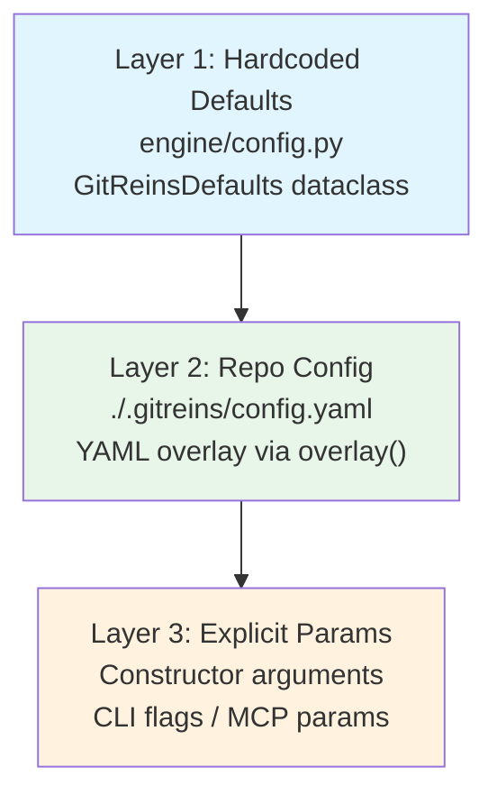

# 07-Config-System.md — Configuration System

> **Document Status:** Draft | **Last Updated:** 2026-06-20 | **Author:** GitReins Configuration Spec

---

## 1. Overview

GitReins uses a unified configuration system with a single source of truth for all defaults: the `GitReinsDefaults` dataclass in `engine/config.py`. Every other module (LLM, evaluator, pipeline, guards, task manager) reads its defaults from this central location rather than hardcoding them locally. This ensures consistency across the CLI, MCP server, and evaluation engine.

The configuration system supports three load layers, type coercion for human-friendly YAML values, backward compatibility with legacy formats, automatic update checking, and graceful degradation when configuration files are missing or malformed.

**File:** `engine/config.py` — 318 lines

---

## 2. GitReinsDefaults Dataclass

`GitReinsDefaults` is a Python `@dataclass` that declares every default value GitReins needs. Creating an instance with no arguments yields production defaults.

### 2.1 Fields

| Field | Type | Default | Description |
|-------|------|---------|-------------|
| `model` | `str` | `"deepseek-v4-flash"` | Default LLM model identifier |
| `max_iterations` | `float` | `100.0` | Max LLM reasoning turns (-1 = unlimited) |
| `max_seconds` | `float` | `-1.0` | Max wall-clock time (-1 = unlimited) |
| `max_input_tokens` | `int` | `10_000_000` | Max input tokens per evaluation |
| `max_output_tokens` | `int` | `1_000_000` | Max output tokens per evaluation |
| `tool_call_weight` | `float` | `0.1` | Iteration cost per tool call |
| `check_for_updates` | `bool` | `True` | Whether to check PyPI for newer versions |
| `update_check_ttl_hours` | `float` | `24.0` | Hours between update checks |
| `history_enabled` | `bool` | `True` | Whether verdict history is persisted |
| `history_path` | `str` | `".gitreins/history"` | Path to history storage (relative to repo) |
| `history_storage` | `str` | `"git"` | `"git"` or `"filesystem"` |
| `history_max_verdicts` | `int` | `1000` | Auto-prune threshold |
| `_source` | `str` | `"(built-in defaults)"` | Internal tracking of config origin |

### 2.2 Methods

| Method | Signature | Purpose |
|--------|-----------|---------|
| `overlay` | `overlay(self, config_dict: dict \| None) -> GitReinsDefaults` | Return a new instance with YAML values overlaid on top of built-in defaults |
| `to_config_dict` | `to_config_dict(self) -> dict` | Produce a dict suitable for writing back to `.gitreins/config.yaml` |

The `overlay()` method only replaces keys explicitly present in the config dict. Missing keys preserve the built-in default. This is a deep-copy operation — the original instance is never mutated.

---

## 3. Load Order

Configuration resolves through three layers. Later layers override earlier ones.



### Layer 1 — Hardcoded Defaults

Instantiated directly: `GitReinsDefaults()`. All values are compile-time constants. No file I/O, no external dependencies.

### Layer 2 — Repo Config (`.gitreins/config.yaml`)

Loaded by `load_defaults(workdir)`:
1. Instantiate base defaults
2. If `.gitreins/config.yaml` exists, parse with `yaml.safe_load`
3. Call `base.overlay(config)` to produce the overlaid result
4. If the file is missing or unreadable, return base defaults unchanged

### Layer 3 — Explicit Parameters

Passed to constructors at runtime:
- `Judge(llm=..., workdir=..., guard_config=..., eval_cap=...)`
- `judge.evaluate_task(task, max_iterations=50, max_time="10m")`
- `AgenticEvaluator(llm, workdir, eval_cap="2")`

These are the highest-priority overrides and are typically used for one-off cap adjustments or testing.

---

## 4. Config File Structure

`.gitreins/config.yaml` is a YAML file with four top-level sections. All sections are optional — missing sections fall back to built-in defaults.

```yaml
# ── Global defaults (overrides engine.config.GitReinsDefaults) ─────
defaults:
  model: deepseek-v4-flash
  max_iterations: 100
  max_time: "30m"
  max_input_tokens: "10M"
  max_output_tokens: "1M"
  tool_call_weight: 0.1
  check_for_updates: true
  update_check_ttl: "24h"

# ── Guards (Tier 1 static checks) ─────────────────────────────────
guards:
  secrets: true
  lint: true
  tests: true
  test_mode: "full"          # "full" or "diff"
  test_command: "pytest -x --tb=short"
  dead_code: false           # opt-in: Python AST-based dead code detection
  skylos: false             # opt-in: multi-language dead code + AI mistake detection

# ── Evaluator caps ───────────────────────────────────────────────
evaluator:
  max_iterations: 100
  max_time: "30m"
  max_input_tokens: "200k"
  max_output_tokens: "50k"
  tool_call_weight: 0.1

# ── Verdict history persistence ──────────────────────────────────
history:
  enabled: true
  path: ".gitreins/history"
  storage: "git"            # "git" or "filesystem"
  max_verdicts: 1000
```

### Section Details

| Section | Keys | Overlay Target |
|---------|------|---------------|
| `defaults` | `model`, `max_iterations`, `max_time`, `max_input_tokens`, `max_output_tokens`, `tool_call_weight`, `check_for_updates`, `update_check_ttl` | `GitReinsDefaults` fields |
| `guards` | `secrets`, `lint`, `tests`, `test_mode`, `test_command`, `dead_code`, `skylos` | `GuardManager` configuration |
| `evaluator` | `max_iterations`, `max_time`, `max_input_tokens`, `max_output_tokens`, `tool_call_weight` | `AgenticEvaluator` caps |
| `history` | `enabled`, `path`, `storage`, `max_verdicts` | `VerdictPersister` settings |

---

## 5. Type Coercion

YAML values are strings by nature. GitReins coerces them to the correct Python types before overlaying onto `GitReinsDefaults`.

### 5.1 Coercion Functions

| Function | Input Examples | Output | Rules |
|----------|---------------|--------|-------|
| `_coerce_float` | `"100"`, `100`, `100.5` | `100.0`, `100.5` | Strips whitespace, falls back to `-1.0` on failure |
| `_coerce_seconds` | `"30s"`, `"5m"`, `"2h"`, `300` | `30.0`, `300.0`, `7200.0` | Supports `s/sec/secs/m/min/mins/h/hr/hrs` suffixes; plain numbers treated as seconds |
| `_coerce_tokens` | `"200k"`, `"10M"`, `5000` | `200000`, `10000000`, `5000` | Supports `k`/`K` (×1,000) and `m`/`M` (×1,000,000) |

### 5.2 Formatting Functions (Reverse)

| Function | Input | Output | Purpose |
|----------|-------|--------|---------|
| `_fmt_seconds` | `300.0` | `"5m"` | Round-trip friendly: writes human-readable time back to config |
| `_fmt_tokens` | `1000000` | `"1.0M"` | Round-trip friendly: writes human-readable token counts |

These formatting functions are used by `to_config_dict()` to produce clean YAML output when regenerating config files.

### 5.3 Coercion Examples

```yaml
# Input (YAML string values)
max_time: "30m"
max_input_tokens: "200k"
max_output_tokens: "1M"
update_check_ttl: "24h"

# After coercion (Python values)
max_seconds = 1800.0
max_input_tokens = 200000
max_output_tokens = 1000000
update_check_ttl_hours = 24.0
```

---

## 6. Update Checker

GitReins can check PyPI for newer versions and notify the user. This is opt-out via `check_for_updates: false`.

### 6.1 Behavior

- **Trigger:** Called at the start of `guard run` and `judge` CLI commands
- **Frequency:** Controlled by `update_check_ttl_hours` (default 24h)
- **Cache:** Stored in `~/.cache/gitreins/update-check.json`
- **Network:** Fetches `https://pypi.org/pypi/gitreins/json` with 5-second timeout
- **Comparison:** Uses `packaging.version.parse` for semantic version comparison

### 6.2 Cache Format

```json
{
  "last_checked": 1718899200.0,
  "latest_version": "0.7.0"
}
```

### 6.3 Output

If an update is available, a yellow notice is printed to stderr:

```
Update available: 0.6.0 → 0.7.0 — https://pypi.org/project/gitreins/
```

If the check fails (network down, PyPI unreachable), it fails silently — no blocking, no error output.

### 6.4 Force Check

The `check_for_update()` function accepts `force=True` to bypass the TTL cache. This is used internally but not exposed as a CLI flag.

---

## 7. Backward Compatibility

GitReins supports legacy configuration formats to avoid breaking existing repositories on upgrade.

### 7.1 Legacy `eval_cap` String

Before individual cap keys existed, caps were specified as a combined string:

```yaml
evaluator:
  eval_cap: "100/30m/200k/50k"
```

This format is still parsed by `parse_eval_cap()` in `engine/eval_cap.py`. The parser extracts:
- Iteration count (`100`)
- Time limit (`30m` → 1800 seconds)
- Input token limit (`200k` → 200,000)
- Output token limit (`50k` → 50,000)

Individual keys take precedence over the legacy string when both are present.

### 7.2 `max_iterations` Kwargs

Many constructors accept `max_iterations` as a direct keyword argument. This is Layer 3 (explicit params) and overrides both the legacy string and individual config keys.

```python
# Layer 3 override — highest priority
AgenticEvaluator(llm, workdir, max_iterations=50)
```

### 7.3 `guards.eval_cap` Fallback

For backward compatibility, `guards.eval_cap` is recognized as a fallback location for the legacy cap string if `evaluator.eval_cap` is not present.

---

## 8. Config Validation

The configuration system follows a "graceful degradation" philosophy: never crash on bad config, always fall back to safe defaults.

### 8.1 Missing Config

If `.gitreins/config.yaml` does not exist, `load_defaults()` returns built-in defaults unchanged. No error, no warning.

### 8.2 Malformed YAML

If `yaml.safe_load()` raises an exception (syntax error, invalid structure), the exception is caught, logged at DEBUG level, and built-in defaults are returned.

```python
except Exception:
    logger.debug("Failed to load %s, using built-in defaults", config_path)
```

### 8.3 Invalid Values

If a value cannot be coerced (e.g., `max_time: "not_a_time"`), the coercion function returns a safe fallback (`-1.0` for time, meaning unlimited). A warning may be logged by the consuming module.

### 8.4 Unknown Keys

Extra keys in `.gitreins/config.yaml` are ignored. They do not cause errors. This allows forward compatibility — new config keys from future versions are silently accepted by older versions.

---

## 9. Factory Functions

| Function | Signature | Purpose |
|----------|-----------|---------|
| `load_defaults` | `load_defaults(workdir: str \| None) -> GitReinsDefaults` | Load defaults overlaid with repo config |
| `load_raw_config` | `load_raw_config(workdir: str \| None) -> dict` | Load `.gitreins/config.yaml` as raw dict without overlay |
| `check_for_update` | `check_for_update(workdir, force=False) -> str \| None` | Check PyPI for updates, respecting TTL |

---

## 10. Constants

| Constant | Value | Purpose |
|----------|-------|---------|
| `UPDATE_CACHE_DIR` | `~/.cache/gitreins` | Directory for update check cache |
| `UPDATE_CACHE_FILE` | `~/.cache/gitreins/update-check.json` | Update check cache file path |

---

## 11. Verification Checklist

| # | Check | Verification |
|---|-------|------------|
| 1 | `GitReinsDefaults()` returns production defaults | `assert defaults.model == "deepseek-v4-flash"` |
| 2 | `overlay()` preserves unmentioned keys | `overlay({"model": "gpt-4"}).max_iterations == 100.0` |
| 3 | `load_defaults(None)` returns built-in defaults | No file I/O attempted |
| 4 | Missing config file → defaults | `load_defaults("/nonexistent")` returns base |
| 5 | Malformed YAML → defaults | `load_defaults(tmp_path)` with bad YAML returns base |
| 6 | Time coercion works for all units | `"30s"`, `"5m"`, `"2h"` → correct seconds |
| 7 | Token coercion works for k/M | `"200k"`, `"10M"` → correct ints |
| 8 | Update check respects TTL | Second call within TTL returns cached result |
| 9 | Update check force bypasses TTL | `force=True` always fetches from PyPI |
| 10 | `to_config_dict()` round-trips cleanly | Output can be re-parsed and re-overlaid |

---

## 12. Document Status

| Field | Value |
|-------|-------|
| **Version** | v0.6.0 |
| **Status** | Draft |
| **Last updated** | 2026-06-20 |
| **Author** | totalwindupflightsystems <totalwindupflightsystems@gmail.com> |
| **Co-author** | wojons <wojonstech@gmail.com> |
